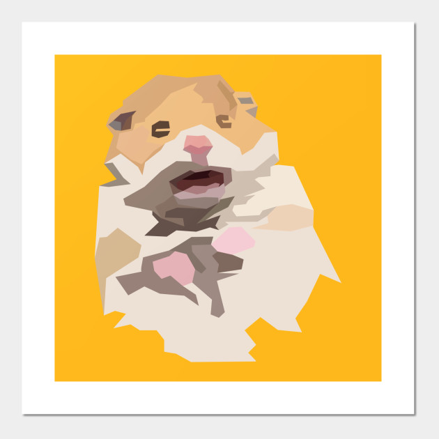

# ɑ-Force

(Alpha Force)

AppDev Dev Class, Spring 2021

## Name Justification
We are the first-ever dev class. This makes us the guinea pigs of an experiment by the team leads of AppDev. Guinea pigs are kind of like hamsters, which reminds us of the movie G-Force, where a bunch of hamsters become secret agents and do cool stuff. We're cool people, so we vibe w/ G-Force. But also we're developers and nerds. So instead, we're calling ourselves Alpha-Force, because we're sort of an alpha test. 

## Logo Justification
The designers were missing from the meeting in which we decided on the logo, so we just used Google Images. 

## Members

### Hanzheng Li
* Major: CS
* Subteam: iOS
* Fun fact: I dream in black & white
* Sp21 pod: Food

