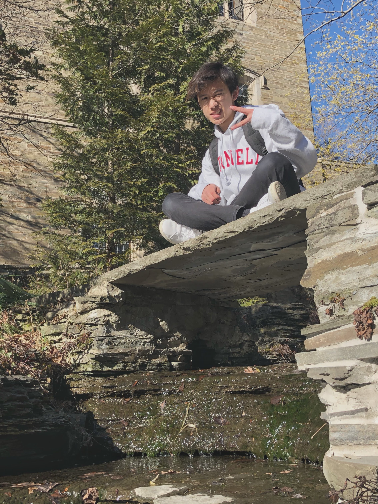

# ɑ-Force

(Alpha Force)

AppDev Dev Class, Spring 2021

## Name Justification
We are the first-ever dev class. This makes us the guinea pigs of an experiment by the team leads of AppDev. Guinea pigs are kind of like hamsters, which reminds us of the movie G-Force, where a bunch of hamsters become secret agents and do cool stuff. We're cool people, so we vibe w/ G-Force. But also we're developers and nerds. So instead, we're calling ourselves Alpha-Force, because we're sort of an alpha test. 

## Logo Justification
The designers were missing from the meeting in which we decided on the logo, so we just used Google Images. Credit to [IIsEggs](https://www.teepublic.com/pl/user/iiseggs) for the design. 

## Members

### Hanzheng Li

* Major: CS
* Subteam: iOS
* Fun fact: I dream in black & white
* Sp21 pod: Food

### Neha Malepati

* Major: CS
* Subteam: Marketing
* Fun fact: favorite Shark Tank product is the Scrub Daddy
* Sp21 pod: Flagship

### Corwin Zhang

* Major: CS
* Subteam: Android
* Fun fact: I almost died when I attempted to jump off a porch using an umbrella as a makeshift parachute
* Sp21 pod: Food

### Noah Solomon

* Major: CS
* Minor: Business
* Subteam: Backend
* Fun fact: I love to cook, tacos are my favorite
* Sp21 pod: Pear

### Gordon Tran

* Major: Information Science
* Subteam: Marketing
* Fun fact: I've had my art put up in a museum before!
* Sp21 pod: Food

### Jonna Chen

* Major: CS
* Subteam: Marketing
* Fun fact: I've been to Mt. Everest before (but not the summit lol)
* Sp21 pod: Volume

### Noah Pikielny

* Major: CS
* Minor: Marine Biology
* Subteam: iOS
* Fun fact: I have a pet sea cucumber
* Sp21 pod: Flagship

